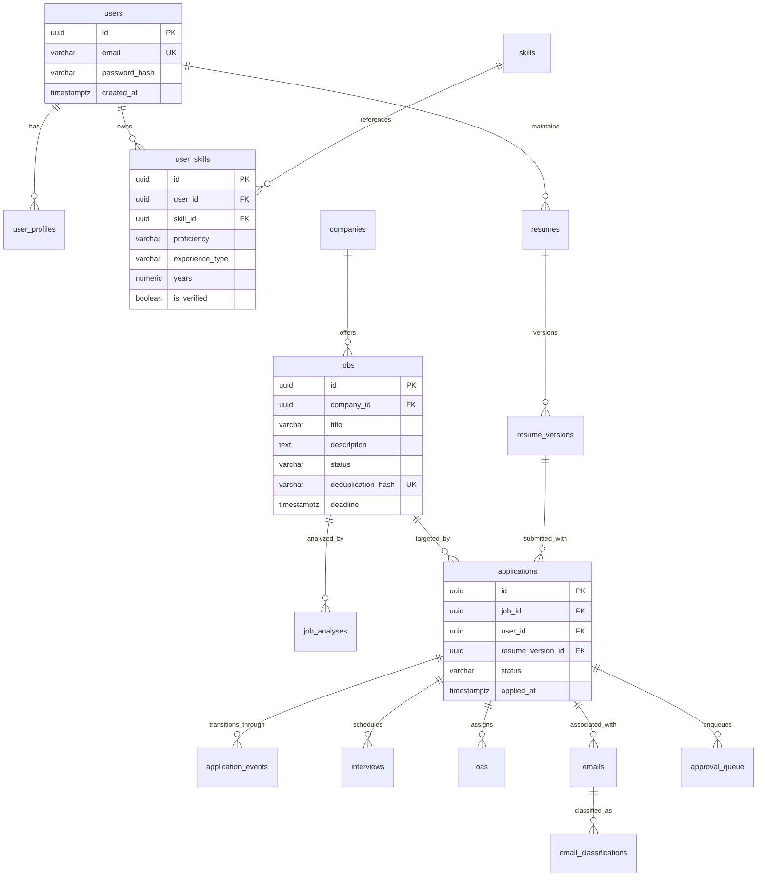

# Entity-Relationship Design

```mermaid
erDiagram
    users ||--o{ user_profiles : "has"
    users ||--o{ user_skills : "owns"
    skills ||--o{ user_skills : "references"
    companies ||--o{ jobs : "offers"
    jobs ||--o{ job_analyses : "analyzed_by"
    users ||--o{ resumes : "maintains"
    resumes ||--o{ resume_versions : "versions"
    jobs ||--o{ applications : "targeted_by"
    resume_versions ||--o{ applications : "submitted_with"
    applications ||--o{ application_events : "transitions_through"
    applications ||--o{ interviews : "schedules"
    applications ||--o{ oas : "assigns"
    emails ||--o{ email_classifications : "classified_as"
    applications ||--o{ emails : "associated_with"
    applications ||--o{ approval_queue : "enqueues"

    users {
        uuid id PK
        varchar email UK
        varchar password_hash
        timestamptz created_at
    }

    user_skills {
        uuid id PK
        uuid user_id FK
        uuid skill_id FK
        varchar proficiency
        varchar experience_type
        numeric years
        boolean is_verified
    }

    jobs {
        uuid id PK
        uuid company_id FK
        varchar title
        text description
        varchar status
        varchar deduplication_hash UK
        timestamptz deadline
    }

    applications {
        uuid id PK
        uuid job_id FK
        uuid user_id FK
        uuid resume_version_id FK
        varchar status
        timestamptz applied_at
    }
```
