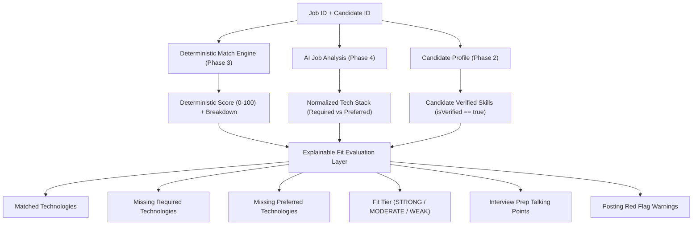

# Phase 4 — AI Job Analysis & Fit Scoring

## 1. Executive Summary

Phase 4 introduces the production-quality, provider-independent **AI Job Analysis & Fit Scoring** layer to the **AI Job Command Center** modular monolith.

### Core Architectural Principles:
1. **Source Truth Immutability**: The canonical job description (`Job.description`) ingested in Phase 3 is preserved as immutable source truth. AI analysis is an explicitly DERIVED entity (`JobAiAnalysis`) and never silently overwrites canonical job text.
2. **Anti-Hallucination Grounding**: AI analysis can neither verify candidate skills nor invent possessed competencies. Only candidate `UserSkill` records with `isVerified() == true` (confirmed via `USER_EXPLICIT`, `WORK_HISTORY`, `ASSESSMENT`, or `CERTIFICATION`) are counted as possessed skills during fit evaluation.
3. **Pluggable & Provider-Independent SPI (`AIProvider`)**: Business logic is completely decoupled from cloud vendors (OpenAI, Anthropic, Gemini, Ollama, Mock). A deterministic offline mock provider (`MockDeterministicAIProvider`) ensures all CI/CD workflows and automated test suites run locally with zero API keys or external network dependencies.
4. **Analysis Versioning & Audit Trail**: Every AI re-analysis produces an incremented version record (`version = max(v) + 1`), preserving complete historical analysis runs per job posting.
5. **Layered Explainable Fit Scoring (`JobAiFitService`)**: AI qualitative analysis (technology gap identification, role normalization, interview prep talking points, red flag warnings) layers *on top of* the deterministic Phase 3 match score without overriding or obscuring it.

---

## 2. Architecture & Module Structure

Following the **Feature-Oriented Modular Monolith** and Hexagonal layering:

```text
com.jobcommandcenter
├── common/             # Cross-cutting error responses, correlation ID, logging
├── security/           # JWT filters, token services, SecurityUser UserDetails adapter
├── user/               # User Identity & Authentication module
├── profile/            # Candidate Profile module
├── skill/              # Skill Catalog & Candidate Skills module
├── job/                # Job Discovery, Normalization & Matching module
└── ai/                 # AI Job Analysis & Fit Scoring module
    ├── api/            # JobAiController, DTO records
    │   ├── JobAiController.java
    │   └── dto/
    │       ├── AnalyzedTechnologyDto.java
    │       ├── JobAiAnalysisResponseDto.java
    │       ├── JobAiFitResponseDto.java
    │       └── TriggerAiAnalysisRequestDto.java
    ├── application/    # Orchestration & fit calculation services
    │   ├── JobAiAnalysisService.java
    │   └── JobAiFitService.java
    ├── domain/         # Domain aggregates, value objects, SPI interface, repository contracts
    │   ├── AIAnalysisStatus.java
    │   ├── AIJobAnalysisRequest.java
    │   ├── AIJobAnalysisResponse.java
    │   ├── AIProvider.java
    │   ├── AnalyzedTechnology.java
    │   ├── JobAiAnalysis.java
    │   ├── JobAiAnalysisRepository.java
    │   ├── JobAiFitEvaluation.java
    │   └── TechnologyCategory.java
    └── infrastructure/ # JPA persistence, provider implementations, factory
        ├── JobAiAnalysisJpaEntity.java
        ├── JobAiAnalysisPersistenceAdapter.java
        ├── JobAiRequirementEmbeddable.java
        ├── JobAiResponsibilityEmbeddable.java
        ├── JobAiTechnologyEmbeddable.java
        ├── SpringDataJobAiAnalysisRepository.java
        └── provider/
            ├── AIProviderFactory.java
            ├── MockDeterministicAIProvider.java
            └── OpenAIProvider.java
```

---

## 3. Database Schema (Flyway V4)

Migration script: `db/migration/V4__job_ai_analyses.sql`

```sql
-- 1. Job AI Analyses Table
CREATE TABLE IF NOT EXISTS job_ai_analyses (
    id UUID PRIMARY KEY,
    job_id UUID NOT NULL REFERENCES jobs(id) ON DELETE CASCADE,
    version INT NOT NULL DEFAULT 1,
    provider VARCHAR(50) NOT NULL,
    model VARCHAR(100) NOT NULL,
    prompt_version VARCHAR(50) NOT NULL,
    status VARCHAR(50) NOT NULL DEFAULT 'PENDING',
    normalized_title VARCHAR(255),
    seniority_level VARCHAR(50),
    experience_expectations VARCHAR(255),
    confidence NUMERIC(3, 2),
    error_message TEXT,
    created_at TIMESTAMP WITH TIME ZONE NOT NULL DEFAULT CURRENT_TIMESTAMP,
    completed_at TIMESTAMP WITH TIME ZONE,
    CONSTRAINT uq_job_ai_analyses_job_version UNIQUE (job_id, version)
);

CREATE INDEX idx_job_ai_analyses_job_id ON job_ai_analyses(job_id);
CREATE INDEX idx_job_ai_analyses_status ON job_ai_analyses(status);
CREATE INDEX idx_job_ai_analyses_created_at ON job_ai_analyses(created_at DESC);

-- 2. Core Responsibilities Table
CREATE TABLE IF NOT EXISTS job_ai_responsibilities (
    analysis_id UUID NOT NULL REFERENCES job_ai_analyses(id) ON DELETE CASCADE,
    responsibility TEXT NOT NULL,
    is_inferred BOOLEAN NOT NULL DEFAULT FALSE,
    PRIMARY KEY (analysis_id, responsibility)
);

-- 3. Technologies Table
CREATE TABLE IF NOT EXISTS job_ai_technologies (
    analysis_id UUID NOT NULL REFERENCES job_ai_analyses(id) ON DELETE CASCADE,
    category VARCHAR(50) NOT NULL,
    technology VARCHAR(100) NOT NULL,
    is_required BOOLEAN NOT NULL DEFAULT TRUE,
    PRIMARY KEY (analysis_id, category, technology)
);

-- 4. Education & Certification Requirements Table
CREATE TABLE IF NOT EXISTS job_ai_requirements (
    analysis_id UUID NOT NULL REFERENCES job_ai_analyses(id) ON DELETE CASCADE,
    requirement_type VARCHAR(50) NOT NULL,
    requirement VARCHAR(255) NOT NULL,
    PRIMARY KEY (analysis_id, requirement_type, requirement)
);

-- 5. Potential Red Flags Table
CREATE TABLE IF NOT EXISTS job_ai_red_flags (
    analysis_id UUID NOT NULL REFERENCES job_ai_analyses(id) ON DELETE CASCADE,
    red_flag TEXT NOT NULL,
    PRIMARY KEY (analysis_id, red_flag)
);
```

---

## 4. Provider SPI & Factory Pattern

The provider architecture is governed by the `AIProvider` SPI:

```java
public interface AIProvider {
    AIJobAnalysisResponse analyzeJob(AIJobAnalysisRequest request);
    String getProviderName();
    String getDefaultModel();
    boolean isAvailable();
}
```

- **`MockDeterministicAIProvider`**: Default offline implementation utilizing heuristic keyword extraction and rule-based NLP to accurately detect seniority levels (`SENIOR`, `LEAD`, `MID`, `JUNIOR`), normalized job titles, required vs. preferred technologies, education/certification requirements, and cultural red flags without external API costs or secrets.
- **`OpenAIProvider`**: Pluggable cloud provider stub configured via `@ConditionalOnProperty(name = "app.ai.provider", havingValue = "OPENAI")`.
- **`AIProviderFactory`**: Discovers all registered `AIProvider` Spring beans, resolving the active provider configured in `app.ai.provider` (defaulting safely to `MOCK`).

---

## 5. Fit Scoring & Explainability Engine (`JobAiFitService`)

The fit evaluation process respects the following workflow:



### Categorization Rules:
- **`STRONG_MATCH`**: Deterministic score $\ge 80$ AND zero missing required technologies.
- **`MODERATE_MATCH`**: Deterministic score $\ge 50$ AND $\le 2$ missing required technologies.
- **`WEAK_MATCH`**: Deterministic score $< 50$ OR $> 2$ missing required technologies.

---

## 6. REST API Endpoints

All endpoints require JWT Bearer authentication:

| Method | Endpoint | Description | Status Code |
| :--- | :--- | :--- | :--- |
| `POST` | `/api/jobs/{id}/ai-analysis` | Triggers AI analysis for a job (increments version) | `201 Created` |
| `GET` | `/api/jobs/{id}/ai-analysis` | Retrieves the latest AI analysis for a job | `200 OK` |
| `GET` | `/api/jobs/{id}/ai-analysis/history` | Retrieves all historical AI analyses for a job | `200 OK` |
| `GET` | `/api/jobs/{id}/ai-fit` | Calculates explainable fit evaluation for candidate | `200 OK` |

---

## 7. Verification & Test Suite

The test suite consists of 67 automated tests passing with 100% success rate:
- `MockDeterministicAIProviderTest`: Validates provider metadata, seniority classification, technology categorization, context-aware requirement detection, and red flag extraction.
- `JobAiAnalysisServiceUnitTest`: Validates version incrementation ($v1 \to v2$), provider failure isolation, and error status persistence.
- `JobAiFitServiceUnitTest`: Enforces anti-hallucination grounding (unverified candidate skills are ignored), required vs preferred technology partitioning, and fit tier calculations.
- `JobAiIntegrationTest`: End-to-end MockMvc testing across authentication, analysis creation, version history, and fit evaluation endpoints.
