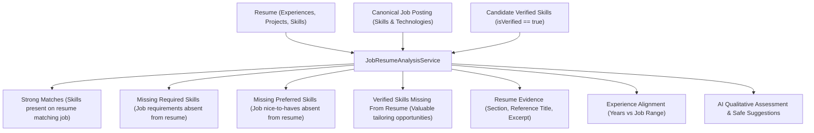

# Phase 5 — Resume Management & Job-Specific Resume Analysis

## 1. Executive Summary

Phase 5 introduces the **Resume Management & Job-Specific Resume Analysis** module to the **AI Job Command Center** modular monolith. It provides a structured, multi-resume management domain and connects it with canonical job postings (Phase 3), candidate verified skills (Phase 2), and AI qualitative analysis (Phase 4).

### Core Architectural Principles:
1. **User-Provided Factual Truth Only**: The candidate's resume entries (work experience, projects, education, certifications, and skills) represent strictly user-entered information. Neither the system nor the AI will ever invent fictitious employers, dates, accomplishments, or competencies.
2. **Analysis and Management Only (No Automatic Rewriting)**: Phase 5 is strictly read/analyze/manage. The system will NOT automatically modify or rewrite the candidate's resume, nor will it auto-apply to jobs.
3. **Anti-Hallucination Verified Skill Distinction**:
   $$\text{Candidate Verified Skills} \neq \text{Skills Appearing on Resume}$$
   A candidate may possess verified proficiency in a skill (e.g., Redis) but omit it from a specific resume version. The system explicitly identifies:
   - **`strongMatches`**: Skills & experience on the resume matching job requirements.
   - **`missingRequiredSkills`**: Mandatory job skills absent from the resume.
   - **`missingPreferredSkills`**: Nice-to-have job skills absent from the resume.
   - **`verifiedSkillsMissingFromResume`**: Legitimate verified competencies possessed by the candidate that are omitted from this resume version (providing immediate, safe tailoring value).
4. **Concrete Resume Evidence**: Every matched skill is mapped to its exact supporting section (`EXPERIENCE`, `PROJECT`, `SKILL`, `CERTIFICATION`) with verbatim excerpts. No fabricated evidence is tolerated.
5. **Safe AI Improvement Suggestions**: If the AI suggests adding a skill, it checks whether the candidate possesses verified proof. If unverified, the system explicitly returns `[NOT_ENOUGH_EVIDENCE]` and forbids fabricating claims.
6. **Strict Ownership & Privacy**: Resumes are strictly isolated per authenticated user (`SecurityUser.getId()`). Accessing another user's resume returns `404 Not Found`.

---

## 2. Architecture & Module Structure

Following the **Feature-Oriented Modular Monolith** and Hexagonal layering:

```text
com.jobcommandcenter
├── common/             # Cross-cutting error responses, correlation ID, logging
├── security/           # JWT filters, token services, SecurityUser UserDetails adapter
├── user/               # User Identity & Authentication module
├── profile/            # Candidate Profile module
├── skill/              # Skill Catalog & Candidate Skills module
├── job/                # Job Discovery, Normalization & Matching module
├── ai/                 # AI Job Analysis & SPI Provider module
└── resume/             # Resume Management & Analysis module
    ├── api/            # ResumeController, DTO records
    │   ├── ResumeController.java
    │   └── dto/
    │       ├── CreateResumeRequest.java
    │       ├── UpdateResumeRequest.java
    │       ├── ResumeResponse.java
    │       ├── ResumeSummaryResponse.java
    │       ├── ResumeExperienceDto.java
    │       ├── ResumeProjectDto.java
    │       ├── ResumeSkillDto.java
    │       ├── ResumeEducationDto.java
    │       ├── ResumeCertificationDto.java
    │       ├── ResumeEvidenceItemDto.java
    │       ├── ExperienceAlignmentDto.java
    │       └── JobResumeAnalysisResponse.java
    ├── application/    # Orchestration & analysis services
    │   ├── ResumeService.java
    │   └── JobResumeAnalysisService.java
    ├── domain/         # Domain aggregates, entities, value objects, repository contracts
    │   ├── Resume.java
    │   ├── ResumeStatus.java
    │   ├── ResumeExperience.java
    │   ├── ResumeProject.java
    │   ├── ResumeSkill.java
    │   ├── ResumeEducation.java
    │   ├── ResumeCertification.java
    │   ├── ResumeEvidenceItem.java
    │   ├── ExperienceAlignment.java
    │   ├── JobResumeAnalysisResult.java
    │   └── ResumeRepository.java
    └── infrastructure/ # JPA persistence, Spring Data repository, persistence adapter
        ├── ResumeJpaEntity.java
        ├── ResumeExperienceJpaEntity.java
        ├── ResumeProjectJpaEntity.java
        ├── ResumeSkillJpaEntity.java
        ├── ResumeEducationJpaEntity.java
        ├── ResumeCertificationJpaEntity.java
        ├── SpringDataResumeRepository.java
        └── ResumePersistenceAdapter.java
```

---

## 3. Database Schema (Flyway V5)

Migration script: `db/migration/V5__resume_management.sql`

```sql
-- 1. Resumes Table
CREATE TABLE IF NOT EXISTS resumes (
    id UUID PRIMARY KEY,
    user_id UUID NOT NULL REFERENCES users(id) ON DELETE CASCADE,
    name VARCHAR(255) NOT NULL,
    title VARCHAR(255),
    summary TEXT,
    years_of_experience NUMERIC(4, 1),
    location VARCHAR(255),
    contact_email VARCHAR(255),
    contact_phone VARCHAR(50),
    status VARCHAR(50) NOT NULL DEFAULT 'DRAFT',
    created_at TIMESTAMP WITH TIME ZONE NOT NULL DEFAULT CURRENT_TIMESTAMP,
    updated_at TIMESTAMP WITH TIME ZONE NOT NULL DEFAULT CURRENT_TIMESTAMP
);

CREATE INDEX IF NOT EXISTS idx_resumes_user_id ON resumes(user_id);
CREATE INDEX IF NOT EXISTS idx_resumes_status ON resumes(status);

-- 2. Resume Work Experience Table
CREATE TABLE IF NOT EXISTS resume_experiences (
    id UUID PRIMARY KEY,
    resume_id UUID NOT NULL REFERENCES resumes(id) ON DELETE CASCADE,
    company VARCHAR(255) NOT NULL,
    job_title VARCHAR(255) NOT NULL,
    start_date DATE,
    end_date DATE,
    currently_working BOOLEAN NOT NULL DEFAULT FALSE,
    location VARCHAR(255),
    description TEXT,
    achievements TEXT,
    technologies TEXT,
    display_order INT NOT NULL DEFAULT 0,
    created_at TIMESTAMP WITH TIME ZONE NOT NULL DEFAULT CURRENT_TIMESTAMP
);

-- 3. Resume Projects Table
CREATE TABLE IF NOT EXISTS resume_projects (
    id UUID PRIMARY KEY,
    resume_id UUID NOT NULL REFERENCES resumes(id) ON DELETE CASCADE,
    project_name VARCHAR(255) NOT NULL,
    description TEXT,
    role VARCHAR(255),
    technologies TEXT,
    responsibilities TEXT,
    achievements TEXT,
    duration VARCHAR(100),
    project_url VARCHAR(1000),
    display_order INT NOT NULL DEFAULT 0,
    created_at TIMESTAMP WITH TIME ZONE NOT NULL DEFAULT CURRENT_TIMESTAMP
);

-- 4. Resume Skills Table (Reuses Centralized Catalog)
CREATE TABLE IF NOT EXISTS resume_skills (
    id UUID PRIMARY KEY,
    resume_id UUID NOT NULL REFERENCES resumes(id) ON DELETE CASCADE,
    skill_id UUID NOT NULL REFERENCES skills(id) ON DELETE RESTRICT,
    proficiency VARCHAR(50),
    years_experience NUMERIC(4, 1),
    created_at TIMESTAMP WITH TIME ZONE NOT NULL DEFAULT CURRENT_TIMESTAMP,
    CONSTRAINT uq_resume_skills_resume_skill UNIQUE (resume_id, skill_id)
);

-- 5. Resume Education Table
CREATE TABLE IF NOT EXISTS resume_education (
    id UUID PRIMARY KEY,
    resume_id UUID NOT NULL REFERENCES resumes(id) ON DELETE CASCADE,
    institution VARCHAR(255) NOT NULL,
    degree VARCHAR(255),
    field_of_study VARCHAR(255),
    start_year INT,
    end_year INT,
    display_order INT NOT NULL DEFAULT 0,
    created_at TIMESTAMP WITH TIME ZONE NOT NULL DEFAULT CURRENT_TIMESTAMP
);

-- 6. Resume Certifications Table
CREATE TABLE IF NOT EXISTS resume_certifications (
    id UUID PRIMARY KEY,
    resume_id UUID NOT NULL REFERENCES resumes(id) ON DELETE CASCADE,
    name VARCHAR(255) NOT NULL,
    issuing_organization VARCHAR(255) NOT NULL,
    issue_date DATE,
    expiry_date DATE,
    credential_id VARCHAR(255),
    credential_url VARCHAR(1000),
    display_order INT NOT NULL DEFAULT 0,
    created_at TIMESTAMP WITH TIME ZONE NOT NULL DEFAULT CURRENT_TIMESTAMP
);
```

---

## 4. Job-Specific Resume Analysis Engine

The `JobResumeAnalysisService` coordinates:
1. Candidate `Resume` aggregate (metadata, experience, projects, skills, education, certifications).
2. Canonical `Job` posting (Phase 3 requirements & description).
3. Candidate `UserSkill` verified profile (Phase 2 truth).
4. `AIProvider` SPI for qualitative evaluation.



---

## 5. REST API Endpoints

All endpoints require JWT Bearer authentication:

| Method | Endpoint | Description | Status Code |
| :--- | :--- | :--- | :--- |
| `POST` | `/api/resumes` | Create new candidate resume in `DRAFT` status | `201 Created` |
| `GET` | `/api/resumes` | List all resumes belonging to authenticated candidate | `200 OK` |
| `GET` | `/api/resumes/{id}` | Retrieve complete resume with all structured sections | `200 OK` |
| `PUT` | `/api/resumes/{id}` | Update resume metadata and structured sections | `200 OK` |
| `DELETE` | `/api/resumes/{id}` | Delete a resume | `204 No Content` |
| `POST` | `/api/resumes/{id}/activate` | Transition resume status to `ACTIVE` | `200 OK` |
| `POST` | `/api/resumes/{id}/archive` | Transition resume status to `ARCHIVED` | `200 OK` |
| `GET` | `/api/resumes/{resumeId}/jobs/{jobId}/analysis` | Evaluate resume fit against a job posting | `200 OK` |
| `POST` | `/api/resumes/{resumeId}/jobs/{jobId}/analysis` | Trigger/re-evaluate resume fit against job posting | `200 OK` |

---

## 6. Verification & Test Suite

The test suite runs 75 automated tests passing with 100% success rate:
- `ResumeAggregateUnitTest`: Tests creation defaults, validation, status transitions (`DRAFT` $\to$ `ACTIVE` $\to$ `ARCHIVED`), and section mutations.
- `JobResumeAnalysisServiceUnitTest`: Validates deterministic matching, missing required/preferred skills, verified skills missing from resume, evidence mapping, experience alignment, and anti-hallucination suggestion verification (`[NOT_ENOUGH_EVIDENCE]`).
- `ResumeIntegrationTest`: End-to-end integration tests for authentication, CRUD lifecycle, user ownership isolation (User B receives 404 when attempting to access User A's resume), and job-specific resume analysis endpoints.
